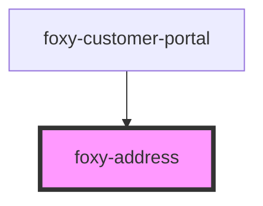

# foxy-address

<!-- Auto Generated Below -->

## Properties

| Property   | Attribute  | Description                                 | Type                                                      | Default                           |
| ---------- | ---------- | ------------------------------------------- | --------------------------------------------------------- | --------------------------------- |
| `endpoint` | `endpoint` | Foxy Customer Portal API endpoint.          | `string`                                                  | `""`                              |
| `locale`   | `locale`   | The language to display element content in. | `any`                                                     | `i18n.defaults.locale.call(this)` |
| `type`     | `type`     | The type of address to display.             | `"default_billing_address" \| "default_shipping_address"` | `"default_billing_address"`       |

## Events

| Event    | Description                                                                                         | Type                                                                                                                                                                                                                                                                                                                                                                                                                                                                                                                                                                                                                                                                                                                                                                                                                                                                                                                                                                                                                                                                                                                                                                                                                                                                                                                                                                                                                                                                                                                                                                                                                                                                                                                                                                                                                                                                                                                                                                                                                                                                                                                                                                                                                                                                                                                                                                                                                                                                                                                                                                                                                                                                                                                                                                                                                                                                                                                                                                                                                                                                                                                                                                                                                                                                                                                                                                                                                                                                                                                                                                                                                                                                                                                                                                                                                                                                                                                                                                                                                                                                                                                                                                                                                                                                                                                                                                                                                                                                                                                                                                                                                                                                                                                                                                                                                                                                                                                                                                                                                                                                                                                                                                                                                                                                                                                                                                                                                                                                                                                                                                                                                                                                                                                                                                                                                                                                                                                                                                                                                                                                                                                                                                                                                                                                                                                                                                                                                                                                                                                                                                                     |
| -------- | --------------------------------------------------------------------------------------------------- | ---------------------------------------------------------------------------------------------------------------------------------------------------------------------------------------------------------------------------------------------------------------------------------------------------------------------------------------------------------------------------------------------------------------------------------------------------------------------------------------------------------------------------------------------------------------------------------------------------------------------------------------------------------------------------------------------------------------------------------------------------------------------------------------------------------------------------------------------------------------------------------------------------------------------------------------------------------------------------------------------------------------------------------------------------------------------------------------------------------------------------------------------------------------------------------------------------------------------------------------------------------------------------------------------------------------------------------------------------------------------------------------------------------------------------------------------------------------------------------------------------------------------------------------------------------------------------------------------------------------------------------------------------------------------------------------------------------------------------------------------------------------------------------------------------------------------------------------------------------------------------------------------------------------------------------------------------------------------------------------------------------------------------------------------------------------------------------------------------------------------------------------------------------------------------------------------------------------------------------------------------------------------------------------------------------------------------------------------------------------------------------------------------------------------------------------------------------------------------------------------------------------------------------------------------------------------------------------------------------------------------------------------------------------------------------------------------------------------------------------------------------------------------------------------------------------------------------------------------------------------------------------------------------------------------------------------------------------------------------------------------------------------------------------------------------------------------------------------------------------------------------------------------------------------------------------------------------------------------------------------------------------------------------------------------------------------------------------------------------------------------------------------------------------------------------------------------------------------------------------------------------------------------------------------------------------------------------------------------------------------------------------------------------------------------------------------------------------------------------------------------------------------------------------------------------------------------------------------------------------------------------------------------------------------------------------------------------------------------------------------------------------------------------------------------------------------------------------------------------------------------------------------------------------------------------------------------------------------------------------------------------------------------------------------------------------------------------------------------------------------------------------------------------------------------------------------------------------------------------------------------------------------------------------------------------------------------------------------------------------------------------------------------------------------------------------------------------------------------------------------------------------------------------------------------------------------------------------------------------------------------------------------------------------------------------------------------------------------------------------------------------------------------------------------------------------------------------------------------------------------------------------------------------------------------------------------------------------------------------------------------------------------------------------------------------------------------------------------------------------------------------------------------------------------------------------------------------------------------------------------------------------------------------------------------------------------------------------------------------------------------------------------------------------------------------------------------------------------------------------------------------------------------------------------------------------------------------------------------------------------------------------------------------------------------------------------------------------------------------------------------------------------------------------------------------------------------------------------------------------------------------------------------------------------------------------------------------------------------------------------------------------------------------------------------------------------------------------------------------------------------------------------------------------------------------------------------------------------------------------------------------------------------------------------------------------------------------------- |
| `ready`  | Fired when component becomes ready to be interacted with.                                           | `CustomEvent<void>`                                                                                                                                                                                                                                                                                                                                                                                                                                                                                                                                                                                                                                                                                                                                                                                                                                                                                                                                                                                                                                                                                                                                                                                                                                                                                                                                                                                                                                                                                                                                                                                                                                                                                                                                                                                                                                                                                                                                                                                                                                                                                                                                                                                                                                                                                                                                                                                                                                                                                                                                                                                                                                                                                                                                                                                                                                                                                                                                                                                                                                                                                                                                                                                                                                                                                                                                                                                                                                                                                                                                                                                                                                                                                                                                                                                                                                                                                                                                                                                                                                                                                                                                                                                                                                                                                                                                                                                                                                                                                                                                                                                                                                                                                                                                                                                                                                                                                                                                                                                                                                                                                                                                                                                                                                                                                                                                                                                                                                                                                                                                                                                                                                                                                                                                                                                                                                                                                                                                                                                                                                                                                                                                                                                                                                                                                                                                                                                                                                                                                                                                                                      |
| `update` | Emitted after the component makes changes to the state, containing the changed data in its payload. | `CustomEvent<{ date_created: string; date_modified: string; } & { id: number; last_login_date: string; first_name: string; last_name: string; email: string; tax_id: string; is_anonymous: boolean; } & { _embedded: Record<"fx:default_billing_address", Address>; } & { _embedded: Record<"fx:default_shipping_address", Address>; } & { _embedded: { "fx:transactions": ({ date_created: string; date_modified: string; } & { _links: { self: { title: string; href: string; type?: string; }; first?: { title: string; href: string; type?: string; }; prev?: { title: string; href: string; type?: string; }; next?: { title: string; href: string; type?: string; }; last?: { title: string; href: string; type?: string; }; } & { "fx:receipt": { title: string; href: string; type?: string; }; }; _embedded: { "fx:attributes": ({ date_created: string; date_modified: string; } & { name: string; value: string; visibility: "public" \| "private"; })[]; "fx:items"?: { name: string; price: number; quantity: number; quantity_min: number; quantity_max: number; weight: number; code: string; parent_code: string; discount_name: string; discount_type: string; discount_details: string; subscription_frequency: string; subscription_start_date: string; subscription_next_transaction_date: string; subscription_end_date: null; is_future_line_item: boolean; shipto: string; url: string; image: string; length: number; width: number; height: number; expires: number; date_created: null; date_modified: string; }[]; }; id: number; display_id: number; is_test: boolean; hide_transaction: boolean; data_is_fed: boolean; transaction_date: string; locale_code: string; customer_first_name: string; customer_last_name: string; customer_tax_id: string; customer_email: string; customer_ip: string; ip_country: string; user_agent: string; total_item_price: number; total_tax: number; total_shipping: number; total_future_shipping: number; total_order: number; currency_code: string; currency_symbol: string; status: "" \| "captured" \| "approved" \| "authorized" \| "declined" \| "pending" \| "rejected"; } & { _embedded: { "fx:items": Item[]; }; })[]; }; } & { _embedded: { "fx:subscriptions": ({ date_created: string; date_modified: string; } & { _links: { self: { title: string; href: string; type?: string; }; first?: { title: string; href: string; type?: string; }; prev?: { title: string; href: string; type?: string; }; next?: { title: string; href: string; type?: string; }; last?: { title: string; href: string; type?: string; }; } & { "fx:sub_token_url": { title: string; href: string; type?: string; }; }; _embedded: { template_config: { allow_next_date_modification: boolean; allow_frequency_modification: false \| string[]; }; "fx:transactions": ({ date_created: string; date_modified: string; } & { _links: { self: { title: string; href: string; type?: string; }; first?: { title: string; href: string; type?: string; }; prev?: { title: string; href: string; type?: string; }; next?: { title: string; href: string; type?: string; }; last?: { title: string; href: string; type?: string; }; } & { "fx:receipt": { title: string; href: string; type?: string; }; }; _embedded: { "fx:attributes": ({ date_created: string; date_modified: string; } & { name: string; value: string; visibility: "public" \| "private"; })[]; "fx:items"?: { name: string; price: number; quantity: number; quantity_min: number; quantity_max: number; weight: number; code: string; parent_code: string; discount_name: string; discount_type: string; discount_details: string; subscription_frequency: string; subscription_start_date: string; subscription_next_transaction_date: string; subscription_end_date: null; is_future_line_item: boolean; shipto: string; url: string; image: string; length: number; width: number; height: number; expires: number; date_created: null; date_modified: string; }[]; }; id: number; display_id: number; is_test: boolean; hide_transaction: boolean; data_is_fed: boolean; transaction_date: string; locale_code: string; customer_first_name: string; customer_last_name: string; customer_tax_id: string; customer_email: string; customer_ip: string; ip_country: string; user_agent: string; total_item_price: number; total_tax: number; total_shipping: number; total_future_shipping: number; total_order: number; currency_code: string; currency_symbol: string; status: "" \| "captured" \| "approved" \| "authorized" \| "declined" \| "pending" \| "rejected"; })[]; "fx:transaction_template": { _embedded: { "fx:items": { name: string; price: number; quantity: number; quantity_min: number; quantity_max: number; weight: number; code: string; parent_code: string; discount_name: string; discount_type: string; discount_details: string; subscription_frequency: string; subscription_start_date: string; subscription_next_transaction_date: string; subscription_end_date: null; is_future_line_item: boolean; shipto: string; url: string; image: string; length: number; width: number; height: number; expires: number; date_created: null; date_modified: string; }[]; }; language: string; locale_code: string; use_customer_shipping_address: boolean; billing_first_name: string; billing_last_name: string; billing_company: string; billing_address1: string; billing_address2: string; billing_city: string; billing_state: string; billing_postal_code: string; billing_country: string; billing_phone: string; customer_email: string; shipping_first_name: string; shipping_last_name: string; shipping_company: string; shipping_address1: string; shipping_address2: string; shipping_city: string; shipping_state: string; shipping_postal_code: string; shipping_country: string; shipping_phone: string; total_item_price: number; total_tax: number; total_shipping: number; total_future_shipping: number; total_order: number; date_created: null; date_modified: string; currency_code: string; currency_symbol: string; }; }; start_date: string; next_transaction_date: string; end_date: string; frequency: string; error_message: string; past_due_amount: number; first_failed_transaction_date: string; is_active: boolean; third_party_id?: string; } & { _embedded: { "fx:transactions": Transaction[]; }; })[]; }; } & { _embedded: Record<"fx:default_payment_method", PaymentMethod>; } & Record<"_links", Record<"fx:checkout", Link>> & { _embedded?: { "fx:attributes"?: Attribute[]; }; }>` |

## Methods

### `getRemoteState() => Promise<GetResponse<{ zoom: Record<AddressType, true>; sso: true; }>>`

Resolves with a customer object containing address
of the default or specified `HTMLFoxyAddressElement.type`.

#### Returns

Type: `Promise<GetResponse<{ zoom: Record<AddressType, true>; sso: true; }>>`

### `getState(forceReload?: boolean) => Promise<any>`

Resolves with a customer object containing address
of the default or specified `HTMLFoxyAddressElement.type`.

#### Returns

Type: `Promise<any>`

### `reset() => Promise<void>`

Clears address form values and resets the component state.

#### Returns

Type: `Promise<void>`

### `setState(value: Partial<FullGetResponse>) => Promise<void>`

Sets customer object.

#### Returns

Type: `Promise<void>`

### `submit() => Promise<void>`

Submits the address form, saving changes in the cloud.

#### Returns

Type: `Promise<void>`

## Dependencies

### Used by

 - [foxy-customer-portal](../customer-portal)

### Graph

----------------------------------------------

*Built with [StencilJS](https://stenciljs.com/)*
